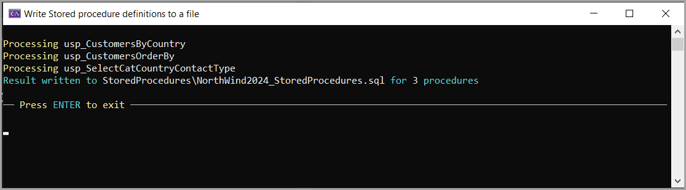

# About

Provides a console project which scans a database for stored procedures and writes the stored procedures if any to a text file under the application path, StoredProcedures with the `database name_StoredProcedures.sql`.

## Setup

Before running, set the connection string in appsettings.json

## Screenshot

## Code

- Written in Microsoft VS2022
- Dapper for data access

## Enhancements

Could be made into a global `dotnet tool` with [little effort](https://learn.microsoft.com/en-us/dotnet/core/tools/global-tools#install-a-global-tool).